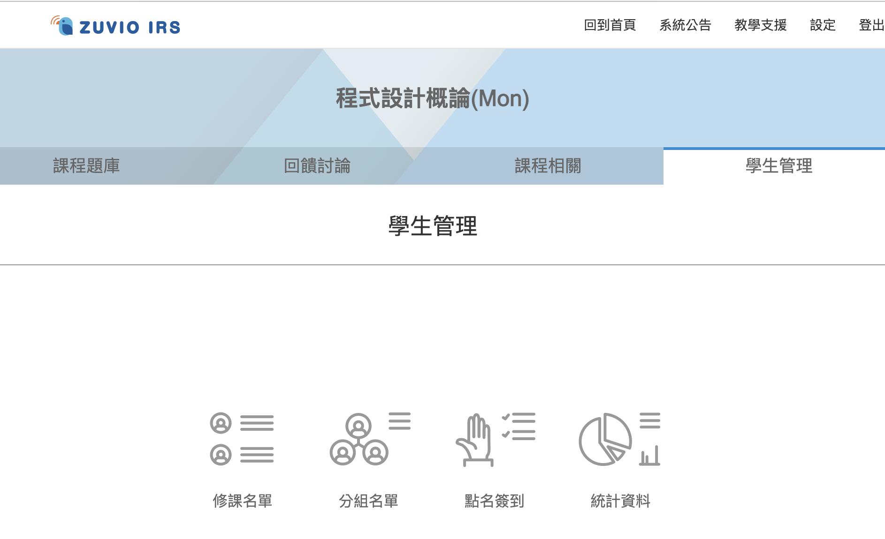
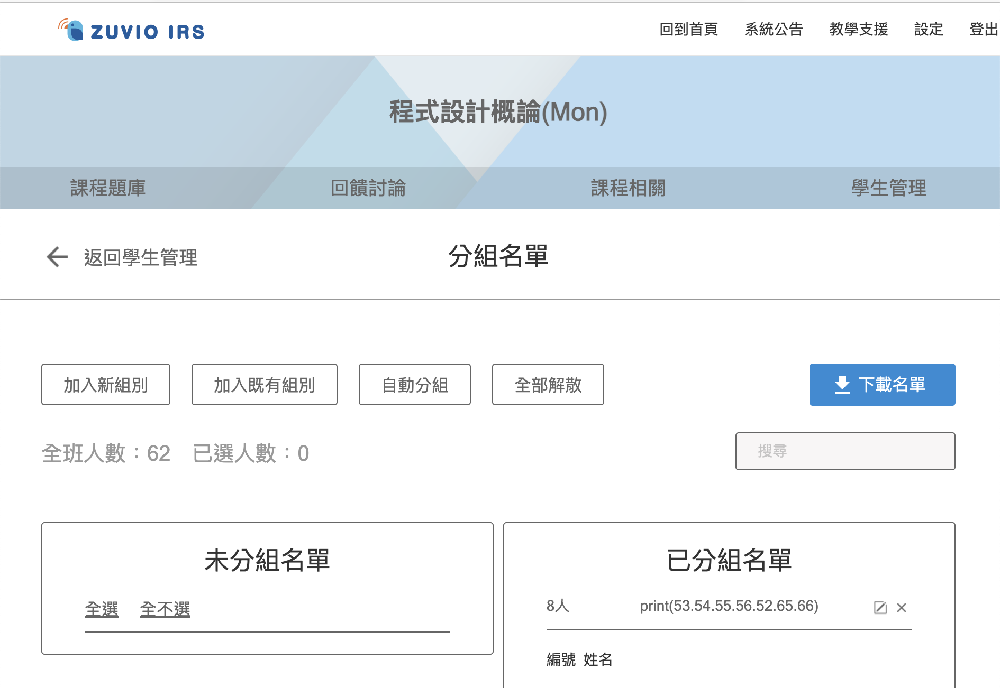

# Zuvio2Webex-group-csv

a simple script that generate group-information csv file for Webex from Zuvio.

---

## Usage
### Step 1
在Zuvio選擇"學生管理" -> "分組名單"

### Step 2
下載名單


### Step 3
執行指令，假設zuvio下載檔案為`zuvio.xlsx`;目標輸出檔案為`webex.csv`
```bash
python3 main.py zuvio.xlsx webex.csv
```

## Requirements
- pandas
